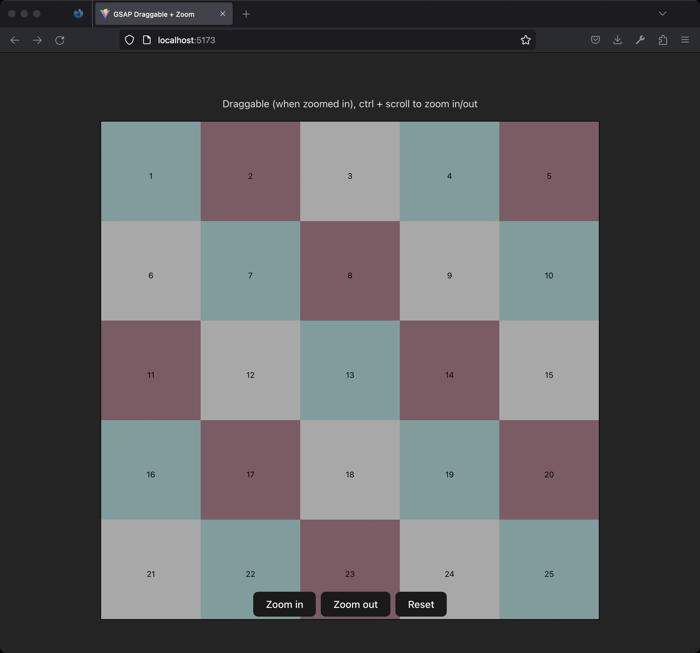

# GSAP SVG Draggable + Zoom

Tiny demo of an SVG element that can be zoomed in/out and dragged around.

Zooming also works when holding down `Ctrl` + scrolling.

:green_heart: Screencaptured with https://gifcap.dev/
